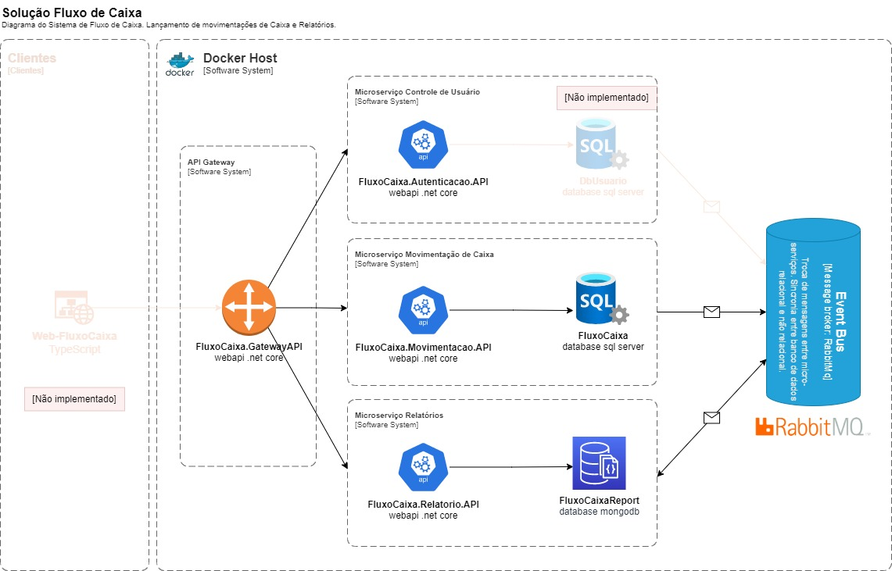

<h1>Projeto Fluxo de Caixa</h1> 

<p align="center">
     
     
     
   
     
  
  
  
</p>

> Status do Projeto: :heavy_check_mark: concluido 

### Tópicos 

:small_blue_diamond: [Descrição do projeto](#descrição-do-projeto)

:small_blue_diamond: [Containers](#containers)
 
:small_blue_diamond: [Pré-requisitos](#pré-requisitos)

:small_blue_diamond: [Como rodar a aplicação](#como-rodar-a-aplicação-arrow_forward)

:small_blue_diamond: [Como utilizar a aplicação](#como-utilizar-a-aplicação-arrow_forward)
 
 
## Descrição do projeto 

<p align="justify">
	<b>Case Fluxo de Caixa</b>
	Um comerciante precisa controlar o seu fluxo de caixa diario com os langamentos (débitos e créditos), também precisa de um relatério que disponibilize o saldo diario consolidado.

	regras: 
	-	Serviço que lava o controle de langamentos;
	-	Serviço do consolidado diário;
	-	Desenho da soIução;
	-	Boas praticas (Design Patterns, Padroes de Arquitetura, SOLID e etc);
</p>
<br>
Solução

### Desenho da solução

</br>

</br>

## Containers

- FluxoCaixa.RabbitMQ;
- FluxoCaixa.MongoDB;
- FluxoCaixa.SQLServer;
- FluxoCaixa.Autenticacao.API;
- FluxoCaixa.Relatorio.API;
- FluxoCaixa.Movimentacao.API;
- FluxoCaixa.Gateway.API;

## Pré-requisitos

- [Visual Studio] 2019 ou [Visual Studio Code]; 
- [.NET] 5;
- [Docker Desktop] v4.15.0;

## Como rodar a aplicação :arrow_forward:

No terminal, clone o projeto: 

```
git clone https://github.com/wvitorhugo/app-fluxo-caixa.git
```

No terminal, inicie os containers com o docker-compose.yml existente no diiretório src: 

```
docker-compose -f .\docker-compose.yml up
```

No Package Manager Console, inicie o banco de dados relacional com o comando abaixo:  
```
Update-Database -StartUpProject FluxoCaixa.Movimentacao.API
```

## Como utilizar a aplicação :arrow_forward:

As requisições são feitas para a API Gateway, que responde no endereço http://localhost:5555 (http://localhost:5555/swagger).
Seguem exemplos de requisição:

Login
```
UsuarioLogin{
	username: string,
	nullable: true,
	senha: string
}
```

<b>Usuário cadastrado</b>
```
UsuarioLogin{
	username: "guest",
	senha: "123"
}
```

```
curl -X POST "https://localhost:5555/api/login" -H  "accept: */*" -H  "Content-Type: application/json" -d "{\"username\":\"maria\",\"senha\":\"123\"}"
```

Adicionar Lançamento
```
LancamentoDto{
	tipo:	string // pattern: ^[D.?C]$
	valor:	number($double)
	maximum: 9999999.99
	minimum: 0.01
	descricao:	string
	nullable: true
}
```

```
curl -X POST "https://localhost:5555/api/lancamento?Tipo=C&Valor=100&Descricao=Teste" -H  "accept: text/plain" -H  "Authorization: Bearer <TOKEN>" -d ""
```

Lançamentos diários

```
Filtro{
	ano: number,
	mes: number,
	dia: number
}
```

```
curl -X GET "https://localhost:5555/api/report/Lancamentos?Ano=2023&Mes=1&Dia=18" -H  "accept: text/plain" -H  "Authorization: Bearer  <TOKEN>"
```
Lançamentos diários consolidado
```
Filtro{
	ano: number,
	mes: number,
	dia: number
}
```

```
curl -X GET "https://localhost:5555/api/report/Consolidado?Ano=2023&Mes=1&Dia=18" -H  "accept: text/plain" -H  "Authorization: Bearer <TOKEN>"
```

 
## Licença 

The [MIT License]() (MIT)

Copyright :copyright: 2023 - Projeto Fluxo de Caixa
